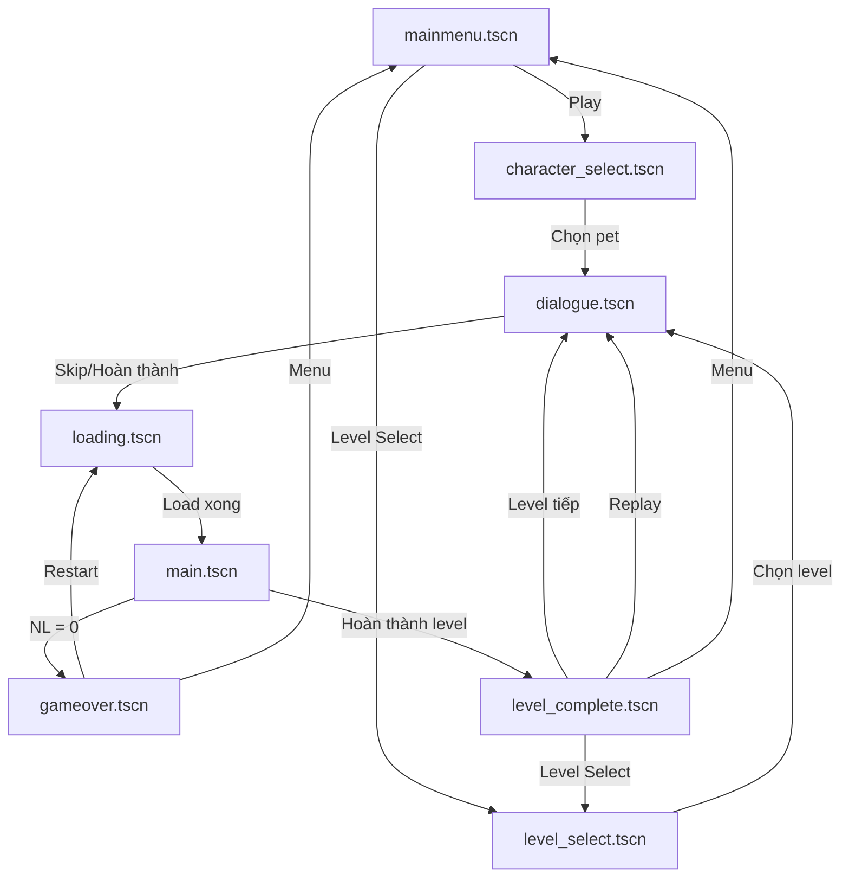

# 📚 TÀI LIỆU KỸ THUẬT — PICK MI UP
## Technical Documentation

---

## 1. Kiến trúc hệ thống

### 1.1 Công nghệ sử dụng
- **Engine**: Godot Engine 4.x
- **Ngôn ngữ**: GDScript
- **Render**: Forward+ 3D
- **Format scene**: `.tscn` (text-based)

### 1.2 Cấu trúc thư mục

```
PickMiUp/
├── addons/proto_controller/  # Player controller (tscn + scenes)
├── assets/                   # Tài nguyên game
│   ├── FRUMISHOP/           # Model cửa hàng Frumi
│   ├── background/          # Background images
│   ├── character/           # Character models
│   ├── dog/                 # Dog models
│   ├── fruit/               # Fruit models
│   ├── milk/                # Milk bottle models
│   └── scene_asset/         # Scene assets
├── docs/                    # Tài liệu
│   ├── game-design.MD       # Game Design Document
│   └── technical-doc.MD     # Tài liệu kỹ thuật (file này)
├── scene/                   # Các scene của game
│   ├── items/               # Scene trái cây (9 loại)
│   ├── FARM.tscn            # Bản đồ nông trại chính (~9MB)
│   ├── main.tscn            # Scene gameplay chính
│   ├── mainmenu.tscn        # Menu chính
│   ├── character_select.tscn
│   ├── level_select.tscn
│   ├── dialogue.tscn
│   ├── loading.tscn
│   ├── gameover.tscn
│   ├── level_complete.tscn
│   ├── basket.tscn
│   ├── frumishop.tscn
│   ├── coin.tscn
│   └── milk_*.tscn          # 3 loại sữa
├── script/                  # Tất cả GDScript
├── global.gd                # Autoload singleton
├── interactable.gd          # Base class cho vật phẩm
├── project.godot            # Cấu hình dự án
├── dog.tscn                 # Scene con chó
├── fox.tscn                 # Scene cáo (pet)
└── turtle.tscn              # Scene rùa (pet)
```

---

## 2. Scene Flow (Luồng chuyển cảnh)



---

## 3. Mô tả chi tiết từng Script

### 3.1 `global.gd` — Singleton Autoload

**Chức năng**: Quản lý trạng thái toàn cục, save/load, settings.

| Biến | Kiểu | Mô tả |
|---|---|---|
| `current_level` | int | Level hiện tại (1-6) |
| `total_coins` | int | Tổng xu tích lũy |
| `best_score` | int | Điểm cao nhất |
| `selected_pet` | String | Pet đã chọn ("fox"/"turtle") |
| `level_stars` | Dictionary | Sao từng level {1:0, 2:0, ...} |
| `settings` | Dictionary | Cài đặt game |

**Hàm quan trọng**:
- `save_data()` / `load_data()` — Lưu/đọc file `user://save_data.cfg`
- `go_to_scene(path)` — Chuyển scene qua loading screen
- `get_pet_bonus(type)` — Lấy bonus pet hiện tại
- `apply_all_settings()` — Áp dụng cài đặt (brightness, volume, v.v.)

---

### 3.2 `proto_controller.gd` — Player Controller

**Extends**: `CharacterBody3D`  
**Dòng code**: ~1030 dòng  
**Chức năng**: Điều khiển nhân vật, HUD, upgrade, energy, inventory, pet, minimap.

#### Các hệ thống con:

| Hệ thống | Hàm chính | Mô tả |
|---|---|---|
| **Di chuyển** | `_physics_process()` | WASD + sprint + gravity + jump |
| **Nhìn** | `rotate_look()` | Mouse look, sensitivity từ settings |
| **Inventory** | `add_to_inventory_typed()`, `deliver_items()` | Nhặt + giao trái cây |
| **Energy** | `drain_energy()`, `add_energy()` | Tiêu hao/hồi NL |
| **Upgrade** | `buy_upgrade()`, `apply_upgrades()` | Mua + áp dụng nâng cấp |
| **Tương tác** | `check_interactable()`, `try_interact()` | Proximity-based (3m) |
| **Milk** | `check_milk()`, `try_pickup_milk()` | Nhặt sữa bằng Q |
| **Pet** | `_spawn_pet()`, `_pet_passive_heal()` | Spawn + hồi NL rùa |
| **Minimap** | `_setup_minimap()` | Khởi tạo minimap |
| **Pause** | `toggle_pause_menu()` | ESC menu |
| **UI** | `update_energy_ui()`, `update_inventory_ui()` | Cập nhật HUD |

#### Tối ưu hiệu năng:
- Proximity check được throttle mỗi 0.15 giây (thay vì mỗi frame)
- Tìm kiếm nearest object thay vì kiểm tra tất cả

---

### 3.3 `level_manager.gd` — Quản lý Level

**Extends**: `Node`  
**Chức năng**: Setup level, spawn items, mission tracking, timer, star calculation.

#### Level Data Structure:
```gdscript
const LEVEL_DATA = {
    1: {
        "required_items": ["apple", "banana"],
        "min_to_pass": 1,
        "time_limit": 0,
        "star_conditions": {1: {items: 1, time: 0}, ...},
        "spawn_items": [{type: "apple", position: Vector3(...)}, ...]
    }, ...
}
```

#### Flow:
1. `_ready()` → `_setup_level()` (deferred)
2. Setup: clear items → spawn level items → spawn milk → setup basket → setup HUD
3. `_process()`: update timer, check play time warning
4. `on_items_delivered()` → `check_mission_progress()` → show choice/complete

---

### 3.4 `minimap.gd` — Mini Map

**Extends**: `Node`  
**Chức năng**: Hiển thị bản đồ thu nhỏ ở góc trên phải HUD.

**Kiến trúc**:
```
MinimapContainer (Control)
├── MinimapBg (Panel) — nền tròn bán trong suốt
├── SubViewportContainer
│   └── SubViewport (200x200)
│       └── MinimapCamera (Camera3D Orthographic)
├── MinimapOverlay (Custom Control) — vẽ dots 2D
├── MinimapTitle (Label) — "MAP"
└── MinimapHint (Label) — "[M] Ẩn/Hiện"
```

**Tối ưu**:
- SubViewport 200x200px (resolution nhỏ)
- Overlay data cập nhật mỗi 0.3s (throttle)
- Camera follow player mỗi frame (nhẹ)

---

### 3.5 `fruit_spawner.gd` — Spawn trái cây ngẫu nhiên

**Chức năng**: Spawn 50 trái cây + 80 sữa ngẫu nhiên khắp map.

**Spawn zones**: Mảng các vùng `{x_min, x_max, z_min, z_max}`:
- Trái cây: 8 vùng (trung tâm → ngoại ô)
- Sữa: 25+ vùng (đường đi, nhà cửa, đồi, ngoại ô, farm)

---

### 3.6 `dog_chase.gd` — AI Chó bảo vệ

**Extends**: `Node3D`  
**Chức năng**: AI đơn giản — phát hiện → đuổi → cắn → dừng.

**Tối ưu**: 
- Distance check dùng `distance_squared` (tránh sqrt)
- Idle check throttle 0.2s
- Không dùng Area3D (tránh lag physics server)

---

### 3.7 `day_night_cycle.gd` — Hệ thống ngày/đêm

**Chức năng**: Xoay DirectionalLight, đổi màu bầu trời, bật/tắt đèn.

**Thông số**:
- Chu kỳ: 60 giây = 1 ngày đêm
- Ban ngày: sun_height > 0.3 → ánh sáng đầy đủ
- Hoàng hôn: sun_height 0-0.3 → gradient cam/tím
- Ban đêm: sun_height < 0 → tối, đèn đường bật

---

### 3.8 `dialogue_manager.gd` — Hội thoại Visual Novel

**Chức năng**: Typing effect, auto advance, skip button.

- Mỗi level có dialogue riêng với 4-5 câu thoại
- Typing speed: 0.03s/ký tự
- Auto advance: 2 giây sau khi hiện đủ text
- Click/Space: skip typing hoặc next dialogue

---

### 3.9 Các script phụ trợ

| Script | Chức năng |
|---|---|
| `pet_follow.gd` | Pet đi theo player |
| `npc_spawner.gd` | Spawn NPC đi lại trên map |
| `npc_wanderer.gd` | AI NPC đi lại ngẫu nhiên |
| `basket_delivery.gd` | Xử lý giao hàng tại rổ |
| `milk.gd` | Script cho vật phẩm sữa |
| `coin.gd` | Script cho coin/trái cây |
| `trash_item.gd` | Script cho vật phẩm rác |
| `heavy_item.gd` | Script cho vật phẩm nặng |
| `interactable.gd` | Base class tương tác |
| `loading_screen.gd` | Màn hình loading (progress bar) |
| `character_select.gd` | Chọn pet |
| `level_select.gd` | Chọn level |
| `mainmenu.gd` | Menu chính (premium styling) |
| `gameover.gd` | Màn hình thua |
| `level_complete.gd` | Màn hình hoàn thành level |

---

## 4. Hệ thống Save/Load

### Format: ConfigFile (`user://save_data.cfg`)

```ini
[game]
best_score=500
tutorial_completed=true
selected_pet="fox"
current_level=3
total_coins=1200

[level_stars]
1=3
2=2
3=1
4=0
5=0
6=0

[settings]
brightness=1.0
master_volume=1.0
music_volume=0.8
sfx_volume=1.0
mouse_sensitivity=0.002
fullscreen=false
vsync=true
```

---

## 5. Hệ thống Input Mapping

```
move_left   → A
move_right  → D
move_up     → W
move_down   → S
ui_accept   → Space (Jump)
sprint      → Shift
interact    → E
pickup_milk → Q
freefly     → F (dev mode)
```

---

## 6. Tối ưu hiệu năng

| Kỹ thuật | Áp dụng |
|---|---|
| **Throttle proximity check** | Player interaction check mỗi 0.15s |
| **Distance squared** | Dog chase dùng dist_sq thay vì distance() |
| **Throttle idle check** | Dog idle check mỗi 0.2s |
| **Deferred calls** | Pet spawn, level setup, minimap setup đều deferred |
| **Minimap throttle** | Overlay data update mỗi 0.3s |
| **SubViewport nhỏ** | Minimap render 200x200px |
| **Group-based search** | Dùng `get_nodes_in_group()` thay vì traverse tree |
